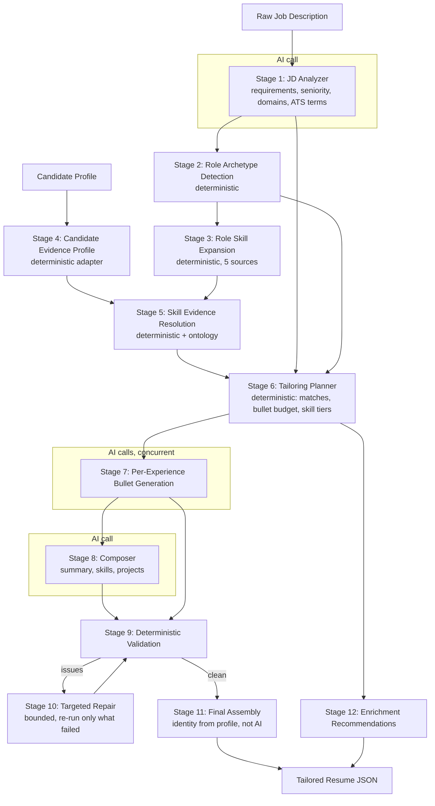

# Resume Tailoring: Full Workflow

This document describes how the application turns a candidate profile plus a job description into a tailored, ATS-optimized resume PDF, with emphasis on the AI pipeline. It reflects the multi-stage pipeline in `lib/tailoring/` that drives `POST /api/analyze`.

---

## 1. Product flow (what the user does)

```
Sign in  ->  Fill profile once  ->  Paste a job posting  ->  Generate  ->  Download PDF
(Supabase)   (contact, education,   (Generator page)         (pipeline)    (+ save to history)
              experience, projects,
              certifications, skills)
```

1. **Sign in** with Supabase email/password.
2. **Fill the profile once** (`/profile`): contact info, education, work experiences (with achievement bullets), projects, certifications, and skills. This is the candidate's source of truth.
3. **Paste a job posting** into the Generator (`/generator`) and click Analyse. A cheap AI model extracts structured job data.
4. **Generate a tailored resume**. The backend runs the 12-stage pipeline, renders a PDF, saves it to the OS Downloads folder, and records the run in `resume_history` (JD + resume JSON archived in Supabase Storage).
5. Optional follow-ups: **ATS match score**, **cover letter**, **interview-question answers**, all grounded in the same resume.

---

## 2. System architecture

| Layer | Role |
|---|---|
| Frontend (`frontend/`) | Next.js UI. Talks to Supabase directly for app data; calls the backend only for AI, PDF, and file saves. |
| Backend (`backend/`) | Express server exposing REST endpoints. Runs all AI calls server-side. |
| Shared library (`lib/`) | Imported by both. Contains the tailoring pipeline, prompts, Supabase services, PDF generation, and types. |
| Supabase | Postgres (profile, resume history, interviews), Auth (JWT), Storage (JD text + resume JSON). |
| AI providers | OpenRouter (multi-model) or direct OpenAI / Anthropic / DeepSeek. Gemini and others are reachable through OpenRouter. |
| Puppeteer + Mustache | HTML template to PDF rendering (`templates/standard.html`, `templates/folio.html`). |

All AI keys live in `backend/.env` and are never exposed to the browser. The frontend only ever sends a request to the backend, which holds the keys.

---

## 3. Every AI call in the system

| Endpoint | AI calls | Purpose | Temperature |
|---|---|---|---|
| `POST /api/extract-job` | 1 (cheap model) | Turn pasted page text into structured job data | 0.1 |
| `POST /api/analyze` | JD analyzer (1) + experiences (N, concurrent) + composer (1) + repair (0 to N) | The full tailoring pipeline | 0.1 / 0.6 / 0.6 |
| `POST /api/check-ats` | 1 | Score keyword/skill match against the JD | 0.2 |
| `POST /api/cover-letter` | 1 | Draft a cover letter from the resume | 0.4 |
| `POST /api/answer-questions` | 1 | Answer interview questions from the resume | 0.3 |

The central AI transport is `lib/ai-provider.ts` (`callAI`), which normalizes OpenRouter and direct providers, handles timeouts/retries, extracts JSON, and computes cost. Model/provider selection is resolved once per request by `lib/ai-api.ts` (`resolveAIRequest`).

---

## 4. The AI tailoring pipeline (the core)

`POST /api/analyze` runs a 12-stage pipeline. Only 3 stages call the AI. Everything about factual grounding, relevance scoring, and validation happens in deterministic application code, so the model is never the sole authority on truth.

### 4.1 The core invariant

> The job description and role intelligence control **relevance, terminology, and prioritization**.
> The candidate profile and its evidence control **what may be claimed as fact**.

Two consequences enforced throughout:

- **Relevance is not possession.** A skill being relevant to the role (or popular in the market, or adjacent to something the candidate knows) never lets it be claimed. Knowing Docker does not claim Kubernetes; knowing AWS does not claim Azure or GCP; React does not claim TypeScript.
- **Evidence in, evidence out.** Every generated bullet is a rephrasing of a real fact from the profile. If a role has no facts, the pipeline emits fewer or no bullets for it rather than inventing.

### 4.2 Pipeline diagram



Orchestrated by `lib/tailoring/pipeline.ts` (`runTailoringPipeline`).

### 4.3 Stage by stage

| # | Stage | AI? | Input | Output | File |
|---|---|---|---|---|---|
| 1 | JD Analyzer | Yes | Raw JD text | `JDAnalysis`: normalized title, seniority, role family, domains, typed requirements, responsibility themes, ATS terms | `jd-analyzer.ts` |
| 2 | Role Archetype Detection | No | `JDAnalysis` | Primary + secondary archetypes with confidence | `role-archetype.ts` |
| 3 | Role Skill Expansion | No | Archetype + JD + candidate skills | `SkillCandidate[]` pool from 5 sources | `role-skill-expansion.ts` |
| 4 | Candidate Evidence Profile | No | Profile payload | `CandidateProfile`: experiences, facts, metrics, declared skills | `candidate-evidence.ts` |
| 5 | Skill Evidence Resolution | No | Skill pool + evidence + ontology | Each skill tagged direct / entailed / declared / project_only / learning / unsupported | `skill-evidence-resolver.ts` |
| 6 | Tailoring Planner | No | All of the above | `TailoringPlan`: requirement matches, per-experience bullet budgets and allowed evidence, skill tiers | `tailoring-planner.ts` |
| 7 | Per-Experience Bullet Generation | Yes (concurrent) | Per role: allowed evidence + relevant requirements + allowed skills + target count | Bullets, each citing `evidenceIds` and `requirementIds` | `experience-generator.ts` |
| 8 | Composer | Yes | Tailored experiences + allowed skills + summary evidence | Summary, grouped skills, soft skills, project descriptions | `composer.ts` |
| 9 | Deterministic Validation | No | Generated output vs plan | List of `ValidationIssue` | `validators.ts` |
| 10 | Targeted Repair | Yes (only failed parts) | Validation issues | Repaired sections | `repair.ts` |
| 11 | Final Assembly | No | Profile + generated content | Final `UpdatedResume` | `assemble.ts` |
| 12 | Enrichment Recommendations | No | Plan | Relevant-but-unsupported skills to ask the candidate about | `enrichment.ts` |

### 4.4 Stage 1: JD Analyzer (AI)

Parses the JD into structured data only. It does not write resume content and does not invent requirements. Each requirement is typed (`must_have` / `preferred` / `optional` / `contextual`) and categorized (technology, architecture, responsibility, methodology, domain, soft_skill, education, experience). Explicit and repeated terms get higher priority. The JD text is treated as untrusted data, not instructions (prompt-injection guard).

Example output:

```json
{
  "normalizedTitle": "Senior Full Stack Python Engineer",
  "seniority": "senior",
  "roleFamily": "software_engineering",
  "domains": ["fintech"],
  "requirements": [
    { "id": "req_1", "text": "Strong experience with Python", "type": "must_have",
      "category": "technology", "canonicalTerm": "Python", "priority": 12 }
  ],
  "responsibilityThemes": ["API design", "mentoring"],
  "atsTerms": ["Python", "FastAPI", "PostgreSQL"]
}
```

### 4.5 Stages 2 and 3: Role intelligence (deterministic)

- **Archetype detection** scores the JD's normalized title and technology terms against a versioned catalog (`role-skill-catalog.ts`) and picks the best-fit archetype (for example `full_stack_python_engineer`) plus secondary matches. Rule-based, so it is cheap and testable without a model.
- **Skill expansion** builds a broad pool of relevant `SkillCandidate`s from five sources: `explicit_jd`, `role_archetype`, `ecosystem`, `market_popularity`, `candidate_profile`. Membership means "relevant to the role." It does not mean the candidate has it. That is decided next.

### 4.6 Stages 4 and 5: Evidence (deterministic, the anti-hallucination core)

- **Candidate Evidence Profile** adapts the profile into an evidence model. Every achievement bullet becomes an `EvidenceFact` with an id; metrics inside it (percentages, multipliers, "doubled", etc.) are extracted as `MetricEvidence` with their own ids; skills mentioned in the text are detected and attached.
- **Skill Evidence Resolution** tags every relevant skill against the candidate's evidence:

| Status | Meaning |
|---|---|
| `direct` | Used in a role (strongest) |
| `entailed` | Inferred through a conservative ontology rule (see below) |
| `declared` | Listed on the profile but no role/project usage |
| `project_only` | Only appears in project evidence |
| `learning` | Marked as learning/familiar |
| `unsupported` | No candidate evidence at all |

**Auto-entailment policy** (`skill-ontology.ts`): only `requires` and a curated set of high-confidence `strongly_implies` relationships (confidence >= 0.8) may auto-create supported evidence, and only from skills with **direct** (role-level) evidence. So Django or FastAPI can auto-support Python. The following relationship types never claim possession: `commonly_used_with`, `alternative_to`, `same_ecosystem`, `market_adjacent`. Concretely:

```
Django            -> Python        requires           auto-supported
FastAPI           -> Python        requires           auto-supported
React             -> TypeScript    commonly_used_with  NOT supported
AWS               -> Terraform     commonly_used_with  NOT supported
AWS               -> Azure / GCP   market_adjacent     NOT supported
Docker            -> Kubernetes    same_ecosystem      NOT supported
RabbitMQ          -> Kafka         alternative_to      NOT supported
```

### 4.7 Stage 6: Tailoring Planner (deterministic)

Decides what to write and from what evidence, without writing any prose:

- **Requirement matches**: each JD requirement labeled strongly_supported / supported / weakly_supported / unsupported, with the backing evidence ids.
- **Bullet budget per experience**: not tenure-only. Scored by `relevanceToJD * 0.45 + recency * 0.25 + evidenceStrength * 0.20 + roleImportance * 0.10`, then capped so a role never exceeds its tenure-based ceiling. A long but weakly relevant old job does not get 9 bullets.
- **Allowed evidence per experience**: only that role's own fact ids and metric ids. This is what makes cross-role contamination impossible.
- **Skill tiers**: supported skills sorted into role-relevant, ecosystem-relevant, and market-relevant buckets; unsupported high-value skills routed to enrichment.

### 4.8 Stage 7: Per-Experience Bullet Generation (AI, concurrent)

Each experience is generated independently and in parallel. For each role the model receives only: immutable identity (title, company, dates, for context, not to change), the allowed evidence facts, the relevant JD requirements, the allowed skills for that role, and a target bullet count. It must return bullets that each cite the `evidenceIds` and `requirementIds` they draw from.

Rules enforced in the prompt and re-checked in code: use only supplied evidence; never invent technologies, metrics, responsibilities, stakeholder scope, or domains; start with strong action verbs; never start with filler (helped, assisted, participated, supported, worked on, contributed, collaborated); do not force a metric into every bullet.

Concurrency uses `Promise.allSettled`, and results are re-mapped to the input order by `experienceId`, so one role failing never corrupts the others (a failed role falls back to its own evidence bullets).

Example output for one role:

```json
{
  "experienceId": "exp_1",
  "bullets": [
    { "text": "Architected Python and FastAPI services powering the checkout flow",
      "evidenceIds": ["fact_exp_1_1"], "requirementIds": ["req_1"] }
  ]
}
```

### 4.9 Stage 8: Composer (AI)

Runs only after experience bullets exist, so the summary is consistent with them. Generates the professional summary (70 to 100 words, preserves seniority, no invented metrics, no generic filler), groups the final skills into role-appropriate categories, selects useful soft skills, and writes tailored project descriptions. It may only select skills from an allow-list already gated by evidence, and it respects a skill budget (default 35 total, 10 per category). The composer's skill output is filtered against the allow-list again in code as defense in depth.

### 4.10 Stage 9: Deterministic Validation

Runs in application code, not as an LLM self-check. It catches:

1. Experience identity changes (title / company / dates)
2. Evidence-id references that do not exist or are not scoped to the right role
3. Requirement-id references that do not exist
4. Ungrounded metrics (any numeric or quasi-numeric claim must map to real metric evidence)
5. Final skills with no supporting evidence
6. Experience skill policy (a skill mentioned in a bullet must be approved for that role; project-only and learning skills do not become professional claims)
7. Bullet count vs plan
8. Duplicate or near-duplicate bullets
9. Summary word count
10. Forbidden opening verbs
11. Overused action verbs
12. Invalid or duplicate experience ids

Issues are returned as structured records, for example:

```json
{ "code": "UNGROUNDED_METRIC", "path": "experience[exp_1].bullets[0]",
  "message": "Metric-like claim \"37%\" has no matching candidate evidence in this experience" }
```

### 4.11 Stage 10: Targeted Repair (bounded)

If validation fails, only the implicated parts are re-run, with the specific errors passed back as repair notes. An all-`UNSUPPORTED_SKILL` composer problem is fixed deterministically (drop the skill) with no extra AI call. Bounded to 2 attempts (`maxRepairAttempts`), after which a deterministic backstop drops offending bullets or skills rather than failing the whole request. Never regenerates the entire resume.

### 4.12 Stage 11: Final Assembly (deterministic, privacy boundary)

The model never generates contact info, company names, titles, dates, or education. Those are assembled from the candidate profile in code. Only the summary, bullets, grouped skills, and project descriptions come from the AI stages. LinkedIn is cleared unless the profile actually has one, so no hallucinated URL can appear.

Privacy: contact fields (name, email, phone, address, LinkedIn) are not sent to any AI stage. The prompts operate on evidence and requirements only; identity is merged back afterward.

### 4.13 Stage 12: Enrichment Recommendations

Skills that are relevant and high-value but unsupported by evidence are returned as recommendations (never inserted into the resume). The Generator UI shows them as a "Consider adding" strip. If the candidate confirms one on their profile, it becomes new evidence on the next run.

---

## 5. Prompt design

The single legacy mega-prompt was replaced by small, stage-specific prompts sharing one policy block:

| Prompt | File | Job |
|---|---|---|
| Global evidence + injection policy | `prompts/tailoring-policy.ts` | Shared preamble: evidence rules, relevance-is-not-possession, untrusted-input guard |
| JD analyzer | `prompts/jd-analyzer-prompt.ts` | Parse JD to structured JSON only |
| Experience writer | `prompts/experience-writer-prompt.ts` | Write bullets for one role from allowed evidence |
| Composer | `prompts/composer-prompt.ts` | Summary, skills, projects from allowed inputs |

Every AI stage validates its output against a Zod schema (`lib/tailoring/schemas.ts`) before the pipeline trusts it. A user-supplied custom prompt (Settings, Prompt) is passed as additional instructions that cannot override the evidence policy.

---

## 6. Model configuration

- Selection is centralized: `resolveAIRequest({ useOpenRouter, apiModel, apiProvider })` in `lib/ai-api.ts`.
- `useOpenRouter: true` routes through OpenRouter (any `provider/model` id, including Gemini and OpenAI). `useOpenRouter: false` uses a direct provider (`openai`, `anthropic`, `deepseek`) with keys from `backend/.env`.
- All calls go through `callAI` in `lib/ai-provider.ts`, which adds timeout, one retry, JSON extraction, and USD cost accounting.
- Recommended: use a model with native structured-output support (OpenAI JSON schema mode, Gemini responseSchema) for the pipeline stages; use a cheaper/faster model for the JD analyzer and job extraction.

---

## 7. Cost and latency

Per resume generation, the pipeline makes roughly `1 (JD analyzer) + N (experiences, concurrent) + 1 (composer)` calls, plus any repair. The three deterministic stages between them add no AI cost. Every response carries a `generationCostUsd` computed from provider-reported cost or a per-model pricing table (`lib/ai-usage.ts`). Concurrency on the per-experience stage keeps wall-clock time close to a single role's latency rather than N times it.

---

## 8. After generation

1. The tailored resume JSON is rendered to a PDF via Mustache + Puppeteer (`templates/standard.html` or `folio.html`, both now render every section: Summary, Skills incl. soft skills, Experience, Education, Certifications, Projects).
2. The PDF is saved to the OS Downloads folder.
3. A `resume_history` row is written and the JD text plus resume JSON are archived to Supabase Storage.
4. Optional: ATS score (`/api/check-ats`), cover letter (`/api/cover-letter`), interview answers (`/api/answer-questions`), each a single grounded AI call.

---

## 9. Anti-hallucination summary

| Mechanism | Where |
|---|---|
| Facts come only from candidate evidence | Stages 4 to 8 |
| Relevance never implies possession | Stage 5 + `skill-ontology.ts` |
| Conservative auto-entailment (requires / strong-implies only, from direct evidence) | `skill-ontology.ts` |
| Per-role evidence scoping | Stage 6 allowed evidence |
| Ungrounded metric detection | Stage 9 validator |
| Skill-support and experience-skill-policy checks | Stage 9 validator |
| Immutable identity assembled in code, not AI | Stage 11 |
| Contact info never sent to AI | Stages 7, 8, 11 |
| Structured-output schema validation | Zod schemas, every AI stage |
| Bounded targeted repair, not full regeneration | Stage 10 |
| Relevant-but-unsupported skills routed to enrichment, never the resume | Stage 12 |
